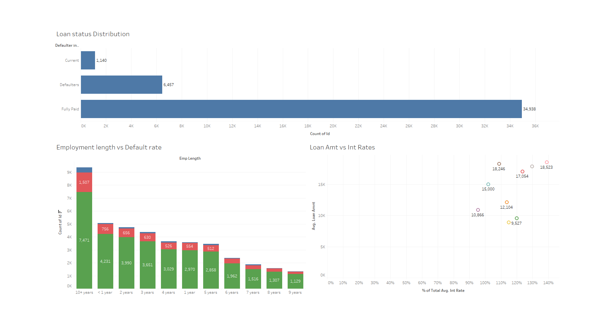
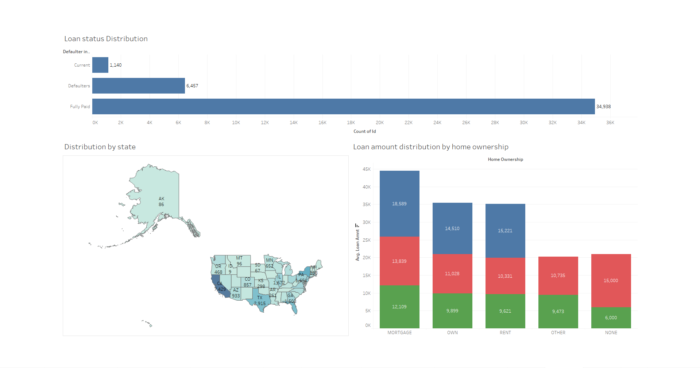

# 🏡 Mortgage Loan Analysis using Tableau

This Tableau project analyzes mortgage loan data to identify trends and risk patterns associated with loan repayment behavior. The goal is to uncover **which types of borrowers are more likely to repay loans** and which ones are more prone to **default**, based on multiple factors such as **loan type**, **interest rate**, **geographical region**, and more.

---

## 📌 Objective

To perform an in-depth analysis of mortgage loan data and derive actionable insights that can help financial institutions:
- Identify **high-risk** and **low-risk** borrowers.
- Improve **loan approval strategies**.
- Understand **demographic and geographic trends** related to loan performance.

---

## 📊 Key Insights

- **Loan Repayment Categories**: Borrowers were categorized into **Fully Paid**, **Defaulters**, and **Current** status using a custom **calculated field**. Originally, the dataset included **7 different loan statuses**, which were grouped into 3 simplified categories for meaningful analysis.
  
- **Defaulter Profile**:
  - Higher default rates observed in certain **loan categories**.
  - Some **geographic regions** showed significantly more defaulters and should be flagged for further risk assessment.
  
- **Positive Indicators of Repayment**:
  - Borrowers with a **higher Debt-to-Income (DTI)** ratio showed **better repayment** behavior.
  - Loans with **lower interest rates** were more likely to be paid off fully.

- **Geographical Analysis**:
  - Certain regions showed a **higher number of applications**.
  - Some of these also had **concentrated default cases**, which can help target risk mitigation strategies.

---

## 📌 Dashboards Included

| Dashboard | Description |
|----------|-------------|
| **Loan Status Distribution** | Bar chart showing the number of borrowers in Fully Paid, Defaulter, and Current status. |

| **DTI vs Loan Performance** | Scatter or bar charts comparing DTI and repayment success. |

| **Geographic Distribution** | Map showing applicant density and defaulters by state/region. |

| **Loan Type Analysis** | Breakdown of default rates by loan type. |


---

## 🧮 Tools & Techniques Used

- **Tool**: Tableau Desktop
- **Data Source**: Mortgage loan dataset (CSV)
- **Techniques**:
  - Custom calculated fields
  - Aggregations and groupings
  - Geographic visualizations
  - Trend and category analysis

---

## 🔗 Tableau Public Link

> [📎 To View Full interactive Dashboard on Tableau Public](https://public.tableau.com/app/profile/sajeesh.k.mohanan/viz/Mortgage_analysis/Story1?publish=yes)

---

## 📂 Project Structure

```
Mortgage_Loan_Analysis/
├── Dataset/
│   └── loan.xlsx
├── Dashboards/
│   └── loan_status_distribution.png
│   └── geographic_analysis.png
│   └── loan_type_defaulters vs DTI.png
├── Tableau_Public_Link.txt
├── Project_Description.md
└── README.md
```

---

## 🚀 Conclusion

This project demonstrates how **data-driven decisions** can help financial institutions **minimize risk** and **maximize repayment success** by understanding patterns in borrower behavior. Through thoughtful visualizations and analysis, we’ve identified the key traits of defaulters vs. fully paid borrowers and provided insights into smarter loan distribution.

---
